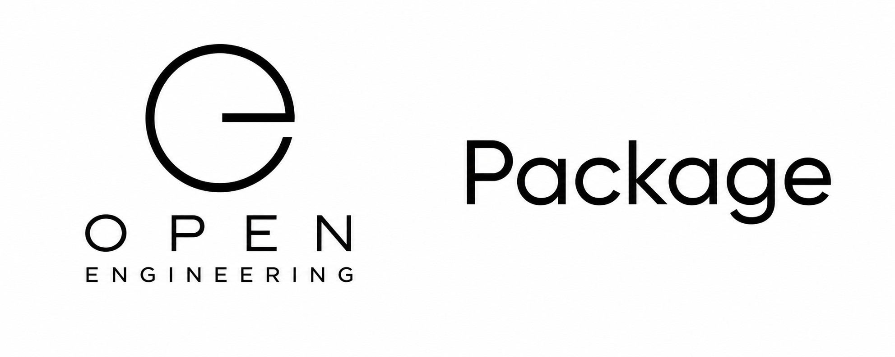

# Open Engineering Package

<p align="center">
  
</p>

Build once. Package well. Use everywhere.

Welcome to Open Engineering Package — the implementation home for individual reusable packages within the Open Engineering ecosystem.

A Package is a versioned, distributable unit of software that implements a defined capability, contract, library, SDK, CLI, adapter, schema toolkit, or other reusable engineering building block.

Where Open Engineering Packages defines and catalogs what packages should exist, Open Engineering Package is where those definitions become working, testable, publishable software.

⸻

## Purpose

Modern engineering ecosystems depend on reusable components, but reuse only works when those components have clear boundaries, predictable interfaces, reliable versioning, and a consistent distribution mechanism.

Open Engineering Package provides a common implementation model for those reusable units.

A package should be:

* Focused — it has a clearly bounded responsibility.
* Reusable — it can serve multiple products, runtimes, compositions, or repositories.
* Versioned — releases follow explicit versioning conventions.
* Testable — behavior can be verified independently.
* Documented — consumers can understand how and why to use it.
* Discoverable — metadata allows the ecosystem to identify and classify it.
* Composable — packages can be combined into larger Open Engineering elements.
* Publishable — releases can be distributed through an appropriate package registry.

The objective is not merely to create libraries.

It is to create dependable engineering building blocks.

⸻

## Package vs. Packages

The Open Engineering ecosystem deliberately separates definitions from implementations.

Organization	Responsibility
open-engineering-packages	Definitions, cataloging, contracts, conventions, and package blueprints
open-engineering-package	Concrete implementations of those package definitions

Conceptually:
```
Package Definition
       │
       ▼
open-engineering-packages
       │
       │ defines
       ▼
Package Contract
       │
       │ implemented by
       ▼
open-engineering-package
       │
       ▼
Build → Test → Version → Publish
       │
       ▼
packages.open-engineering.io
       │
       ▼
Consumers
```
This separation allows a package contract to remain stable while implementations evolve independently.

⸻

## Repository Model

The source repository acts as the implementation workspace and reference point for Open Engineering Package.

A typical package implementation may follow a structure such as:
```
source/
├── README.md
├── LICENSE
├── package.json
├── metadata.yaml
├── src/
├── test/
├── docs/
├── examples/
└── .github/
    └── workflows/
```
The exact structure depends on the package technology and applicable Open Engineering conventions.

For an npm-compatible package, for example:
```
source/
├── package.json
├── README.md
├── LICENSE
├── src/
│   └── index.ts
├── test/
│   └── index.test.ts
├── docs/
├── examples/
├── metadata.yaml
└── .github/
    └── workflows/
        ├── test.yaml
        └── publish.yaml
```
⸻

Package Lifecycle

A package moves through a deliberate lifecycle.
```
Define
  │
  ▼
Implement
  │
  ▼
Validate
  │
  ▼
Test
  │
  ▼
Version
  │
  ▼
Build
  │
  ▼
Publish
  │
  ▼
Discover
  │
  ▼
Consume
  │
  └───────────────┐
                  ▼
               Improve
                  │
                  └──────► Version
```
### 1. Define

The package begins with a definition maintained by Open Engineering Packages.

The definition describes what the package is intended to provide without unnecessarily prescribing its implementation.

### 2. Implement

The package definition is realized as executable source code.

### 3. Validate

Metadata, structure, interfaces, schemas, and conventions are checked.

### 4. Test

Automated tests establish that the implementation satisfies its contract.

### 5. Version

A release receives an explicit version according to Open Engineering versioning conventions.

### 6. Build

The implementation is transformed into its distributable representation.

### 7. Publish

The resulting artifact is published to an appropriate registry.

### 8. Consume

Other Open Engineering repositories, applications, runtimes, tools, and compositions declare the package as a dependency.

⸻

## Package Registry

Open Engineering packages are intended to be distributable through a dedicated package endpoint:

`packages.open-engineering.io`

This provides a stable ecosystem-level namespace independent of the underlying registry technology.

Conceptually:
```
GitHub
  │
  │ source + releases
  ▼
CI/CD
  │
  │ build + validate + test
  ▼
Package Registry
  │
  ▼
packages.open-engineering.io
  │
  ├──► Developers
  ├──► CI/CD
  ├──► Applications
  ├──► CLIs
  ├──► Runtimes
  ├──► Compositions
  └──► AI Engineering Agents
```
The public Open Engineering domain therefore becomes the stable interface while registry infrastructure can evolve behind it.

⸻

## npm-Compatible Packages

JavaScript and TypeScript packages may be distributed using the npm package model.

For example:

`npm install @open-engineering/example`

or, depending on the selected package manager:
```
pnpm add @open-engineering/example
deno add npm:@open-engineering/example
```

A registry configuration can point package tooling toward:

`https://packages.open-engineering.io/`

The precise registry implementation and publication conventions are defined separately so package source code does not become tightly coupled to registry infrastructure.

⸻

## Metadata

Every package should expose machine-readable metadata describing its place in the Open Engineering ecosystem.

For example:
```
kind: Package
metadata:
  name: example
  namespace: open-engineering
spec:
  definition:
    organization: open-engineering-packages
    repository: source
  implementation:
    organization: open-engineering-package
    repository: source
  distribution:
    registry: packages.open-engineering.io
    ecosystem: npm
```
The authoritative schema and field names should follow the applicable Open Engineering repository and metadata conventions.

This metadata allows packages to participate in the wider Open Engineering semantic graph.

⸻

## Packages as Elements

Packages are not isolated artifacts.

They can become dependencies of higher-level Open Engineering elements:
```
Package
   │
   ├──► Capability
   │
   ├──► Capsule
   │
   ├──► Parser
   │
   ├──► Rule
   │
   ├──► Composer
   │
   ├──► Application
   │
   ├──► Runtime
   │
   └──► Operating System
```
A small package may therefore become part of progressively larger compositions without needing to know those compositions in advance.

That is an important property of the architecture:

Packages provide capabilities without owning the systems that compose them.

⸻

## Composition over Duplication

When functionality is useful to more than one implementation, extracting it into a package should be considered before copying it.

Instead of:
```
Application A ── duplicated utility
Application B ── duplicated utility
Application C ── duplicated utility
```
prefer:
```
              Open Engineering Package
                       │
             ┌─────────┼─────────┐
             ▼         ▼         ▼
        Application A  B         C
```
This creates a reusable engineering library rather than a growing collection of duplicated solutions.

⸻

## Relationship to the Open Engineering Ecosystem

Open Engineering Package participates in a larger chain of definition, implementation, composition, and execution.
```
Definitions
     │
     ▼
Packages
     │
     ▼
Package Implementations
     │
     ▼
Registry
     │
     ▼
Capabilities / Capsules / Elements
     │
     ▼
Compositions
     │
     ▼
Runtimes
     │
     ▼
Running Systems
```
Packages therefore occupy an important position between engineering knowledge and executable systems.

⸻

## Automation

Package repositories should favor automated lifecycle management.

A mature implementation should be able to perform:
```
commit
   ↓
lint
   ↓
validate
   ↓
test
   ↓
build
   ↓
version
   ↓
release
   ↓
publish
   ↓
index
```
CI/CD should make publishing repeatable rather than relying on manually assembled releases.

⸻

## AI-Native Engineering

Packages should also be understandable by machines.

Clear metadata, contracts, examples, tests, dependency declarations, and documentation allow AI engineering agents to reason about questions such as:

* What package provides this capability?
* Which version should I use?
* What does this package depend on?
* Is this package compatible with my runtime?
* How do I install it?
* What contract does it implement?
* Can it be safely upgraded?
* Which package definition produced this implementation?

This makes the package registry more than artifact storage.

It becomes part of the machine-readable engineering landscape of Open Engineering.

⸻

## Design Principles

Open Engineering Package follows the broader principles of Open Engineering:

### Definition before implementation
Understand what should exist before deciding how to build it.

### Composition over duplication
Reusable behavior belongs in reusable building blocks.

### Loose coupling
Packages should depend on explicit contracts rather than hidden implementation assumptions.

### Explicit interfaces
Consumers should know what a package promises.

### Independent versioning
Packages evolve at their own appropriate cadence.

### Automation by default
Validation, testing, building, releasing, and publishing should be reproducible.

### Discoverability
A package that cannot be found is difficult to reuse.

### Evidence-driven engineering
Tests, provenance, releases, and metadata provide evidence about what software actually is.

### Open by design
Packages should remain understandable, inspectable, portable, and interoperable wherever practical.

⸻

## Related Open Engineering Organizations

The package model connects naturally with:

* Open Engineering Packages — package definitions and catalog
* Open Engineering Package — package implementations
* Open Engineering Definitions — reusable engineering definitions
* Open Engineering Elements — composable engineering elements
* Open Engineering Capabilities — reusable capabilities
* Open Engineering Capsules — encapsulated ecosystem capabilities
* Open Engineering Conventions — shared engineering conventions
* Open Engineering Composers — composition definitions
* Open Engineering Composer — composition implementations
* Open Engineering Runtimes — execution environments

Together they support a progression from intent to reusable implementation to running system.

⸻

## The Goal

The goal of Open Engineering Package is simple:

Make useful engineering work easy to package, publish, discover, compose, and reuse.

A package should not merely contain code.

It should carry enough structure, metadata, evidence, documentation, and automation to become a dependable building block in a much larger engineering ecosystem.

⸻

<p align="center">
  <strong>Define. Implement. Package. Publish. Compose.</strong>
</p>
<p align="center">
  <a href="https://open-engineering.io">open-engineering.io</a>
</p>
